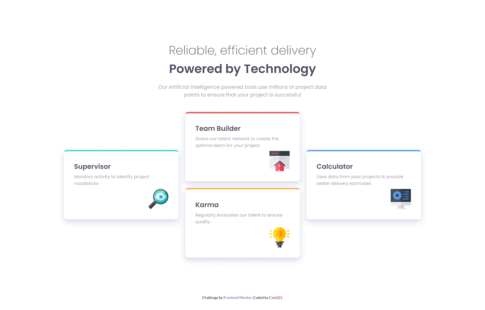
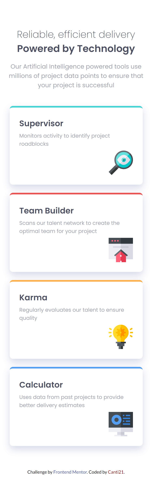

# Frontend Mentor - Four card feature section solution

This is a solution to the [Four card feature section challenge on Frontend Mentor](https://www.frontendmentor.io/challenges/four-card-feature-section-weK1eFYK). 

## Overview

### 🎯 The challenge

Users should be able to:

- View the optimal layout for the site depending on their device's screen size

The target designs are in the [`/design`](./design/) folder.

### 📷 Screenshots

**Here is the final product**

🖥️ Desktop View:

📱 Mobile View:

### 🔗 Links

- Solution URL: [FrontEnd Mentor]()
- Live Site URL: [Deploy]()

## 🛠 Built with

- Semantic HTML5 markup
- CSS custom properties
- Flexbox
- CSS Grid
- Mobile-first workflow

## 🐱‍👤 Author

- Frontend Mentor - [@Canti21](https://www.frontendmentor.io/profile/Canti21)
- Twitter - [@Canti2100](https://www.twitter.com/Canti2100)